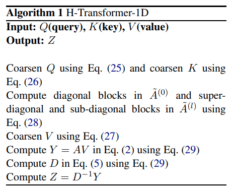

</img>

## H-Transformer-1D

Implementation of <a href="https://arxiv.org/abs/2107.11906">H-Transformer-1D</a>, Transformer using hierarchical Attention for sequence learning with subquadratic costs.

## Install

```bash
$ pip install h-transformer-1d
```

## Usage

```python
import torch
from h_transformer_1d import HTransformer1D

model = HTransformer1D(
    num_tokens = 256,          # number of tokens
    dim = 512,                 # dimension
    depth = 2,                 # depth
    causal = False,            # autoregressive or not
    max_seq_len = 8192,        # maximum sequence length
    heads = 8,                 # heads
    dim_head = 64,             # dimension per head
    block_size = 128           # block size
)

x = torch.randint(0, 256, (1, 8000))   # variable sequence length
mask = torch.ones((1, 8000)).bool()    # variable mask length

# network will automatically pad to power of 2, do hierarchical attention, etc

logits = model(x, mask = mask) # (1, 8000, 256)
```

## Citations

```bibtex
@misc{zhu2021htransformer1d,
    title   = {H-Transformer-1D: Fast One-Dimensional Hierarchical Attention for Sequences}, 
    author  = {Zhenhai Zhu and Radu Soricut},
    year    = {2021},
    eprint  = {2107.11906},
    archivePrefix = {arXiv},
    primaryClass = {cs.LG}
}
```
